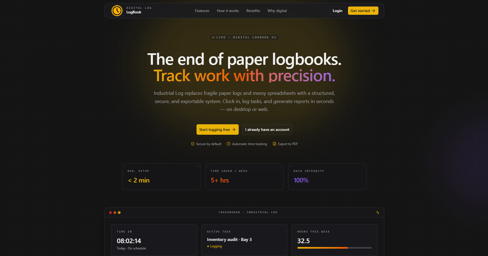
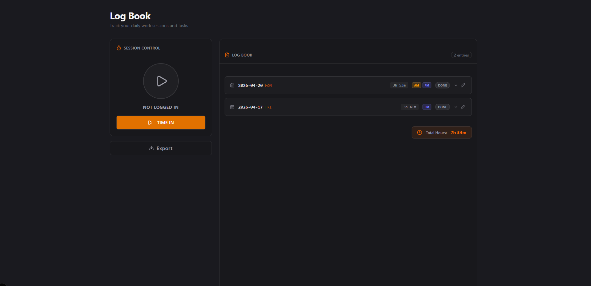

# Digital Logbook Application



<!--  -->

## Overview

The **Digital Logbook Application** is a modern, cross-platform system designed to replace traditional paper-based logbooks. It allows users to efficiently track daily activities, time logs, and task progress in a structured and secure environment.

Built with a modern stack (Next.js + Electron + Drizzle ORM), the application supports both **offline desktop usage** and potential **scalable multi-user environments**.

---

## Problem Statement

Traditional logbooks (paper or manual spreadsheets) suffer from:

- Prone to data loss and damage
- Difficult to organize and search entries
- No real-time tracking of time-in/time-out
- Manual computation of working hours
- Lack of security and user accountability
- No export or reporting capabilities

---

## Solution

This Digital Logbook solves those issues by providing:

- Automated time tracking (Time In / Time Out)
- Structured task management
- Secure data storage (local or database)
- Easy data retrieval and filtering
- Export functionality (PDF / reports)
- Modern and responsive UI

---

## Impact

### For Students / Interns

- Improves productivity tracking
- Simplifies OJT / internship documentation
- Eliminates manual logbook writing

### For Organizations

- Enables accurate monitoring of employee or intern activity
- Reduces administrative overhead
- Improves accountability and transparency

### For Developers (Portfolio Value)

- Demonstrates full-stack capability
- Showcases desktop + web hybrid architecture
- Implements real-world CRUD + time tracking system

---

## Features

- Time In / Time Out tracking
- Task logging per day
- Logbook dashboard
- Export to PDF / reports
- Search and filter logs
- Desktop application (Electron)
- Web-ready architecture (Next.js API)

---

## Tech Stack

- **Frontend:** Next.js, React, TailwindCSS
- **Backend:** Next.js API Routes
- **Database:** Drizzle ORM + SQLite / SQL
- **Desktop:** Electron
- **Other Tools:** TypeScript, Axios

---

## Project Structure (Simplified)

```
my-log/
├── app/
│   ├── api/
│   ├── dashboard/
│   └── page.tsx
├── components/
├── db/
├── dist-electron/   (ignored)
├── release/         (ignored)
├── public/
└── package.json
```

---

## Future Improvements

- Authentication system (multi-user support)
- Cloud sync (Firebase / Supabase / custom API)
- Mobile version (React Native / Flutter)
- Advanced analytics dashboard
- Notifications & reminders

---

## Installation

```bash
# clone repo
git clone https://github.com/your-username/your-repo.git

# install dependencies
npm install

# run development
npm run dev

# run electron
npm run electron
```

---

## Conclusion

The Digital Logbook transforms a **manual, error-prone process** into a **structured, efficient, and scalable system**. It is not just a productivity tool but a foundation for building more advanced workforce or student management systems.

---

## Author

Developed by: Anthony Crausus
Role: Full Stack Developer

---
